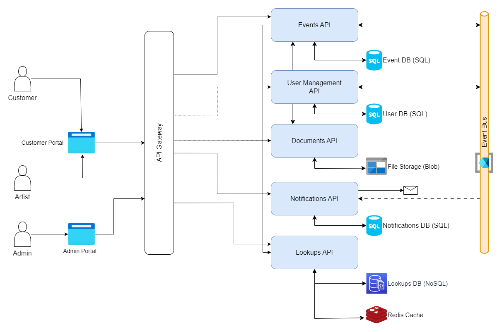

# Event Bookings

A simple web application to manage event bookings. Users can create, view, update, and delete bookings for various events. This will be developed purely with Microsoft stack with the Backend APIs using .NET and the Frontend using Blazor SSR.

## Projects Structure

The following is the projects are implemented as a part of the solution:

- **BuildingBlocks** - Class Library containing cross-cutting concerns across all microservices
- **BuildingBlocks.Messaging** - Class Library containing shared logic for event driven architecture
- **Events API** - Microservice handling Events-related logic
- **User Management API** - Microservice to manage users and roles
- **Documents API** - Microservice to handle upload and download of files from Blob Storage
- **Notifications API** - Microservice to handle email notifications
- **Lookups API** - Microservice used to store and retrieve lookups across the entire solution
- **ApiGateway** - The API Gateway for all microservices
- **Frontend** - The UI of the project built using Blazor
- **Frontend.Admin** - The Admin UI intended for application administrator functionalities

## Application Architecture

## Contributing

Feel free to open a PR and submit your ideas.
